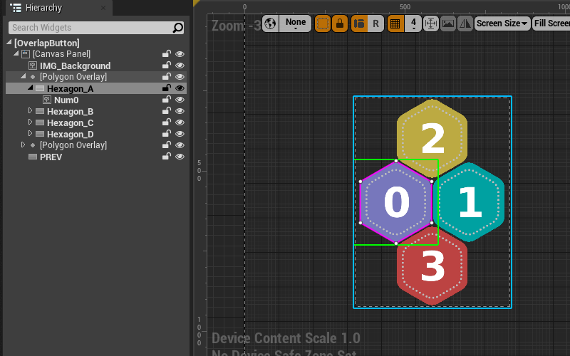

# PolygonButton

PolygonButton is a UnrealEngine plugin to provide polygon clickable area buttons for UMG. You can find the plugin in UnrealEngine [Marketplace](http://unrealengine.com/marketplace/en-US/product/polygonbutton)

## How to use

After you install the plugin(and keep in mind to enable it from `Settings`->`Plugins`->`Angry`->`PolygonButton`), then you will find a new widget type listed in the UMGEditor palette called `PolygonButton`, under a new category `Polygon`.

Drag a new button into the desinger surface to create a polygon button widget, the default polygon area is the whole rect area of the button and you can see the detail polygon data in Details panel.

Here we setup the button appearance using transparent images, and try to make a polygon along the shape.

To move a polygon vertex, just left click and drag it(and it is not allowed to exceed the button area).To insert a polygon vertex, just hold `ctrl` and click a vertex. To delete a polygon vertex, just hold `shift` and click a vertex.

Edit the polygon along the shape, we should get something like this:

To compare with normal buttons, we set up a normal button on left side and a polygon button on right side. You can see that, the normal button immediately be hovered when we enter the button rect, while the polygon button won't be hovered until we enter the shape. This also applied to click event.

## Overlap button

Usually, we can't overlap two sibling buttons because the move event is bubbled and will only triggerred to one of them, but that is acceptable because overlapping two normal button doesn't make sense since they are not only visually overlapped but also logically overlapped(click event). But with polygon button, we have a workaround to make overlap buttons(However, this is not perfect and we will mention that at the end).

To deal with the bubbled move event(so as the hover event), we must make one of the button as the child of the other. The image bellow illustrate this:

Notice that by default, widget attached in the button slot will padded down a little bit when the button is pressed. Here we set the `Normal Padding` and `Pressed Padding` to zero. And here is the final effect:

The drawback is that there is only one button slot for each button so make `PolygonButtonB` the child of `PolygonButtonA` takes that slot, then we can't attach other thing to that slot anymore(usually it could be a textblock or something like that).

