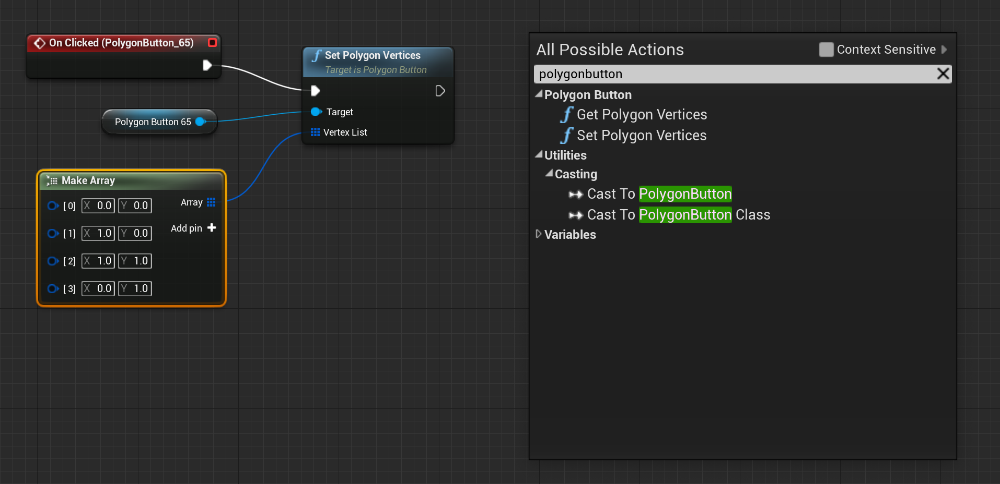

# PolygonButton

PolygonButton is a UnrealEngine plugin to provide polygon clickable area buttons for UMG. You can find the plugin in UnrealEngine [Marketplace](http://unrealengine.com/marketplace/en-US/product/polygonbutton)

## How to use

After you install the plugin(and keep in mind to enable it from `Settings`->`Plugins`->`Angry`->`PolygonButton`), then you will find a new widget type listed in the UMGEditor palette called `PolygonButton`, under a new category `Polygon`.

Drag a new button into the desinger surface to create a polygon button widget, the default polygon area is the whole rect area of the button and you can see the detail polygon data in Details panel.

Here we setup the button appearance using transparent images, and try to make a polygon along the shape.

To move a polygon vertex, just left click and drag it(and it is not allowed to exceed the button area).To insert a polygon vertex, just hold `ctrl` and click a vertex. To delete a polygon vertex, just hold `shift` and click a vertex.

Edit the polygon along the shape, we should get something like this:

To compare with normal buttons, we set up a normal button on left side and a polygon button on right side. You can see that, the normal button immediately be hovered when we enter the button rect, while the polygon button won't be hovered until we enter the shape. This also applied to click event.

## Overlap button

Usually, we can't overlap two sibling buttons because the move event is bubbled and will only triggerred to one of them, but that is acceptable because overlapping two normal button doesn't make sense since they are not only visually overlapped but also logically overlapped(click event). But with polygon button and polygon overlay widgets, we have a workaround to make overlap buttons.

To deal with the bubbled move event(so as the hover event), we introduce polygon overlay(`PolygonOverlay` widget will also be found under `Polygon` category on UMGEditor palette) widget as container panel. There is a dummy layer(automaticly created and won't show in UMGEditor) on top of all overlay slots(which hold polygon buttons) to capture events. By unhandle all events captured, events will fallback to polygon overlay widget and then be dispatched to actual polygon buttons:

Notice that we must make sure the overlay area covers all polygon button clickable areas. As showed in the second picture, the polygon button(green rect) may exceed the overlay area(blue rect), but blue rect still covers all polygon clickable area. And here is the final effect:

Currently, polygon overlay won't support nested polygon buttons. All polygon buttons must be overlay's direct children.

## Blueprint node

We provide two blueprint functions to Get/Set polygon vertices. Notice that the vertices datas should be normalized (you can refer to datas showed in detail panel).

